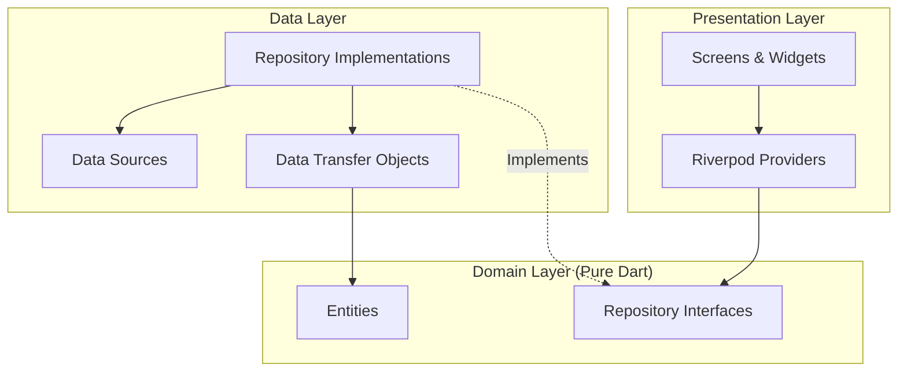

# NauGiDay 🍳

NauGiDay is a Flutter application designed to help home cooks decide what to cook based on the ingredients they have. It features ingredient scanning, AI-powered recipe suggestions (stubbed for MVP), and a personal recipe book.

## Features

-   **Scan Ingredients**: Capture photos of ingredients using the device camera.
-   **Recipe Suggestions**: Get Vietnamese recipe suggestions based on detected ingredients.
-   **Recipe Details**: View cooking steps, required ingredients, and nutrition information.
-   **My Recipes**: Create, save, and manage your own recipes locally.

## Getting Started

### Prerequisites

-   [Flutter SDK](https://flutter.dev/docs/get-started/install) (Stable channel)
-   CocoaPods (for iOS)
-   Android Studio / Xcode

### Installation

1.  **Clone the repository**:
    ```bash
    git clone <repository-url>
    cd NauGiDay
    ```

2.  **Install dependencies**:
    ```bash
    flutter pub get
    ```

3.  **Generate code** (Required for Riverpod, Freezed, Hive):
    ```bash
    dart run build_runner build --delete-conflicting-outputs
    ```

### Environment & Secrets

- Pass secrets via `--dart-define` or a local `.env` that stays uncommitted; never write secrets into recipe storage.
- Verify `.env*`, API keys, and build outputs stay git-ignored before pushing.

## Running Locally

### iOS Simulator

1.  Open the iOS Simulator.
2.  Run the app:
    ```bash
    flutter run -d iphone
    ```
    *Note: The camera feature might not work fully on the simulator without mock data or specific simulator settings.*

### Android Emulator

1.  Start an Android Emulator via Android Studio.
2.  Run the app:
    ```bash
    flutter run -d android
    ```

## Testing

Run the test suite to verify the application logic and UI.

### Unit & Widget Tests

```bash
flutter test
```

## Technical Architecture

The project follows **Clean Architecture** principles to ensure separation of concerns, testability, and maintainability.

### High-Level Overview



### Layer Details

1.  **Presentation Layer** (`lib/presentation`)
    -   **Screens & Widgets**: UI components built with Material 3.
    -   **State Management**: Uses **Riverpod** (`flutter_riverpod`, `riverpod_annotation`) to manage state and dependency injection.
    -   **Navigation**: Uses **GoRouter** for declarative routing.

2.  **Domain Layer** (`lib/domain`)
    -   **Entities**: Immutable Dart objects (e.g., `Recipe`, `Ingredient`) defined using `freezed`.
    -   **Repository Interfaces**: Abstract contracts defining data operations (e.g., `RecipeRepository`).
    -   **Independence**: This layer has NO dependencies on Flutter, data sources, or external libraries (except `freezed_annotation`).

3.  **Data Layer** (`lib/data`)
    -   **Repositories**: Concrete implementations of domain interfaces (e.g., `LocalRecipeRepository`).
    -   **Data Sources**:
        -   **Hive**: Local Key-Value storage for persisting user recipes.
        -   **FakeAiRecipeService**: A stubbed service simulating AI responses (to be replaced by Gemini API).
    -   **DTOs**: Data Transfer Objects for JSON serialization/deserialization, mapping raw data to Domain Entities.

### Key Decisions

-   **Riverpod**: Chosen for its compile-time safety, easy testing overrides, and separation of UI from logic.
-   **Hive**: Selected for local storage due to its speed and simplicity for storing NoSQL-like data (recipes).
-   **Freezed**: Used to generate immutable data classes and unions, reducing boilerplate and ensuring data safety.
